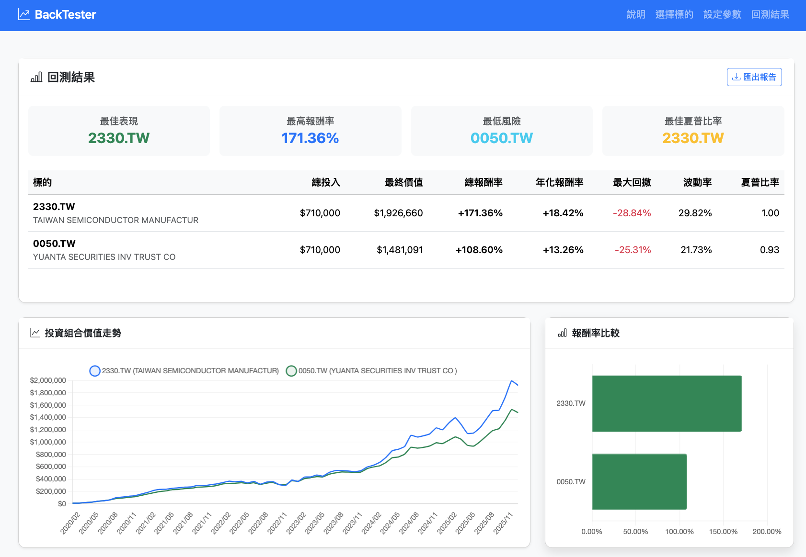
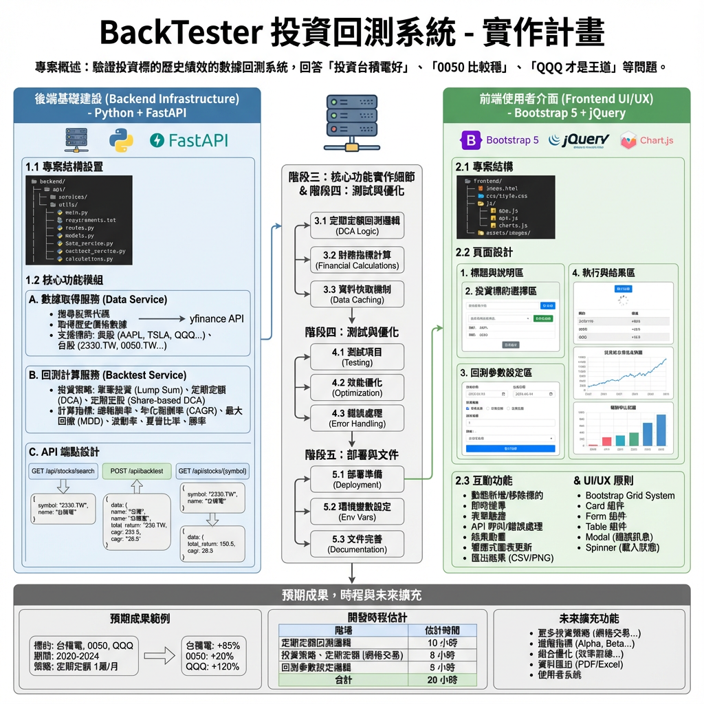

# BackTester - 投資回測系統

> 用數據說話，驗證你的投資理論



## 專案簡介

你是否常聽到這些說法？
- 「投資台積電好」
- 「0050 比較穩」
- 「QQQ 才是王道」

**但誰說的比較準呢？**

BackTester 是一個投資回測系統，讓你可以用歷史數據驗證不同投資標的的實際表現。
只需選擇標的、設定投資策略，就能看到如果你在過去 X 年投資，現在會有多少報酬。

## 功能特色

- **多標的比較**：同時回測多個股票或 ETF，一目了然誰表現更好
- **靈活策略**：支援單筆投資、定期定額等不同投資方式
- **完整指標**：提供報酬率、最大回撤、夏普比率等專業財務指標
- **視覺化呈現**：圖表化顯示投資組合價值變化與績效比較
- **全球市場**：支援美股、台股等主要市場

## 實作計畫



## 技術架構

```
├── backend/          # FastAPI 後端服務
│   ├── main.py
│   ├── api/
│   ├── services/
│   └── utils/
├── frontend/         # Bootstrap + jQuery 前端
│   ├── index.html
│   ├── css/
│   └── js/
├── PLAN.md          # 完整實作計畫
├── CLAUDE.md        # 技術文件
└── README.md        # 本文件
```

### 後端技術
- **FastAPI**：現代化的 Python Web 框架
- **yfinance**：取得 Yahoo Finance 股票數據
- **pandas**：資料處理與分析
- **numpy**：數值計算

### 前端技術
- **Bootstrap 5**：響應式 UI 框架
- **jQuery**：簡化 DOM 操作與 AJAX
- **Chart.js**：互動式圖表

## 快速開始

### 環境需求

- Python 3.8+
- 現代瀏覽器（Chrome, Firefox, Safari, Edge）

### 安裝步驟

#### 1. Clone 專案
```bash
git clone <repository-url>
cd vibe-backtester
```

#### 2. 啟動後端服務
```bash
cd backend
source ../.venv/bin/activate  # 啟用虛擬環境
uv pip install -r requirements.txt  # 安裝依賴
uvicorn main:app --reload --port 8000
```

後端 API 將運行在 `http://localhost:8000`
- API 文件：http://localhost:8000/docs

#### 3. 啟動前端服務
```bash
cd frontend
python -m http.server 8080
```

前端將運行在 `http://localhost:8080`

## 使用方式

### 基本流程

1. **選擇投資標的**
   - 在搜尋框輸入股票代碼或名稱
   - 或點擊快速新增按鈕（台積電、0050、QQQ）
   - 可同時選擇多個標的進行比較

2. **設定回測參數**
   - 選擇起始日期與結束日期
   - 選擇投資策略：
     - 單筆投資：一次性投入所有資金
     - 定期定額：每月固定金額投入
   - 輸入投資金額

3. **執行回測**
   - 點擊「開始回測」按鈕
   - 系統會自動計算並顯示結果

4. **查看結果**
   - 比較表格：顯示各標的詳細指標
   - 價值走勢圖：查看投資組合價值變化
   - 報酬率比較圖：直觀比較各標的表現

### 股票代碼格式

- **台股**：需加上 `.TW` 後綴
  - 台積電：`2330.TW`
  - 0050：`0050.TW`
  - 聯發科：`2454.TW`

- **美股**：直接使用股票代碼
  - 蘋果：`AAPL`
  - 特斯拉：`TSLA`
  - QQQ：`QQQ`
  - S&P 500：`SPY`

## 使用範例

### 範例 1：比較台灣三大 ETF

**設定**：
- 標的：0050.TW、0056.TW、006208.TW
- 期間：2018-01-01 至 2024-12-31
- 策略：每月定期定額 10,000 元

**可能結果**：
- 0050 總投入 840,000 元，最終價值 1,200,000 元（+42.8%）
- 0056 總投入 840,000 元，最終價值 1,050,000 元（+25.0%）
- 006208 總投入 840,000 元，最終價值 980,000 元（+16.7%）

### 範例 2：台積電 vs QQQ

**設定**：
- 標的：2330.TW、QQQ
- 期間：2020-01-01 至 2024-12-31
- 策略：單筆投資 100,000 元

**可能結果**：
- 台積電最終價值 185,000 元（+85%，年化報酬率 16.5%）
- QQQ 最終價值 220,000 元（+120%，年化報酬率 21.8%）

## API 文件

詳細 API 文件可在後端啟動後訪問：
http://localhost:8000/docs

### 主要端點

```
GET  /api/stocks/search          搜尋股票
POST /api/backtest               執行回測
GET  /api/stocks/{symbol}        取得股票資訊
```

更多細節請參考 [PLAN.md](PLAN.md) 中的 API 設計章節。

## 財務指標說明

| 指標 | 說明 |
|------|------|
| **總報酬率** | (最終價值 - 總投入) / 總投入 × 100% |
| **年化報酬率 (CAGR)** | 複合年均成長率，反映長期平均報酬 |
| **最大回撤 (MDD)** | 從最高點到最低點的最大跌幅 |
| **波動率** | 價格波動程度，數值越大風險越高 |
| **夏普比率** | 風險調整後報酬，數值越高越好（>1 為佳） |

## 注意事項

1. **資料來源**
   - 本系統使用 Yahoo Finance 數據
   - 資料可能有延遲或不準確
   - 台股資料需確保使用 `.TW` 後綴

2. **回測限制**
   - 歷史績效不代表未來表現
   - 未考慮交易成本、稅務、匯率等因素
   - 結果僅供參考，不構成投資建議

3. **使用建議**
   - 回測期間建議至少 1 年以上
   - 定期定額需至少 3 個月才有意義
   - 可搭配不同策略多次測試

## 常見問題

**Q: 為什麼找不到我的股票？**
- 請確認股票代碼格式正確（台股需加 `.TW`）
- 某些較小型股票可能無 Yahoo Finance 資料
- 嘗試使用完整股票代碼

**Q: 定期定額是在每月哪一天投入？**
- 系統使用每月第一個交易日的收盤價計算

**Q: 可以回測多久以前的數據？**
- 取決於 Yahoo Finance 提供的歷史數據範圍
- 通常可回測 10-20 年

**Q: 計算結果為何與實際投資有差異？**
- 回測未計入交易手續費、稅金
- 未考慮配息再投入
- 使用收盤價，實際可能無法買到該價格

## 未來規劃

- [ ] 支援配息再投入選項
- [ ] 新增價值平均法策略
- [ ] 提供投資組合優化建議
- [ ] 匯出 PDF 報告功能
- [ ] 儲存歷史回測記錄
- [ ] 支援加密貨幣回測

## 開發文件

詳細的開發文件請參考：
- [PLAN.md](PLAN.md)：完整的實作計畫與架構設計
- [CLAUDE.md](CLAUDE.md)：技術細節與開發指引

## 貢獻指南

歡迎提出 Issue 或 Pull Request！

開發前請先閱讀 [CLAUDE.md](CLAUDE.md) 了解專案架構。

## 授權

本專案採用 MIT 授權條款。

## 免責聲明

本系統提供的回測結果僅供教育與研究用途，不構成任何投資建議。
投資有風險，過去績效不代表未來表現。
使用者應自行評估投資風險，並諮詢專業財務顧問。

---

Made with Python & FastAPI
